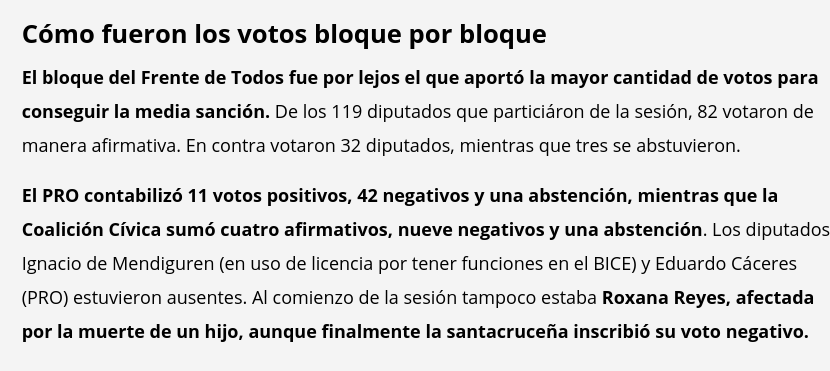
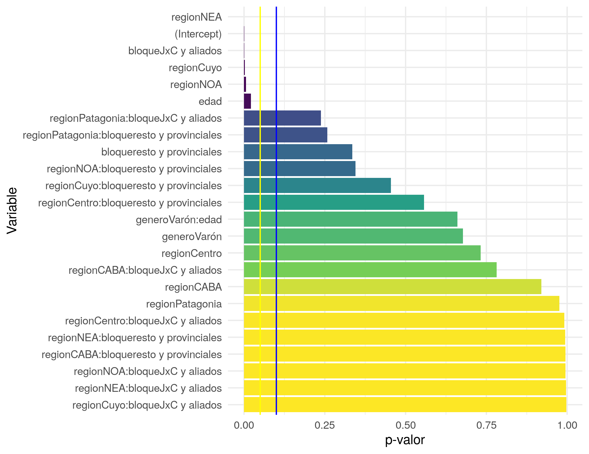
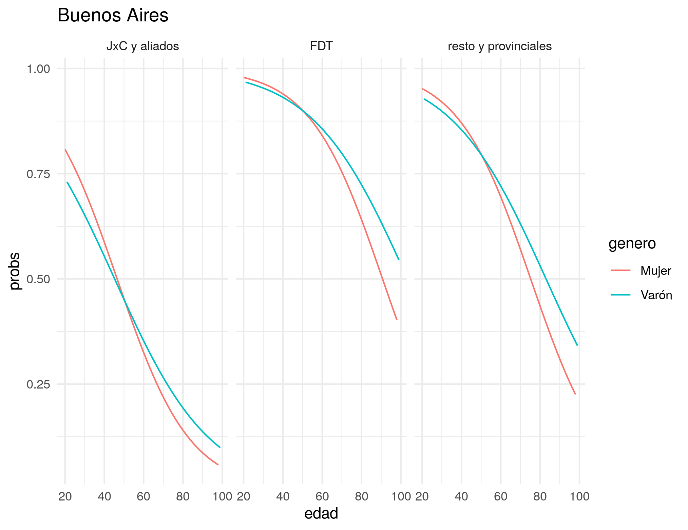
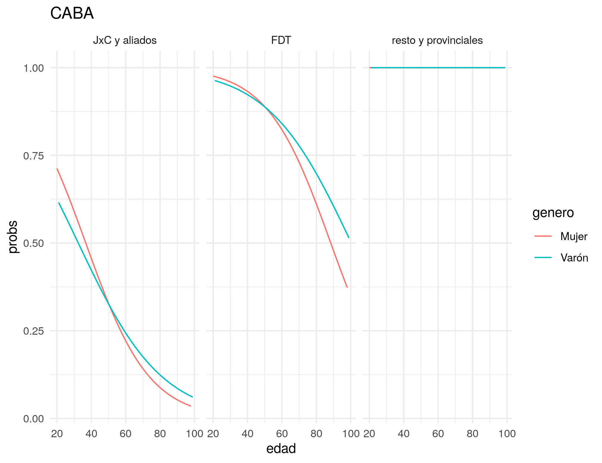
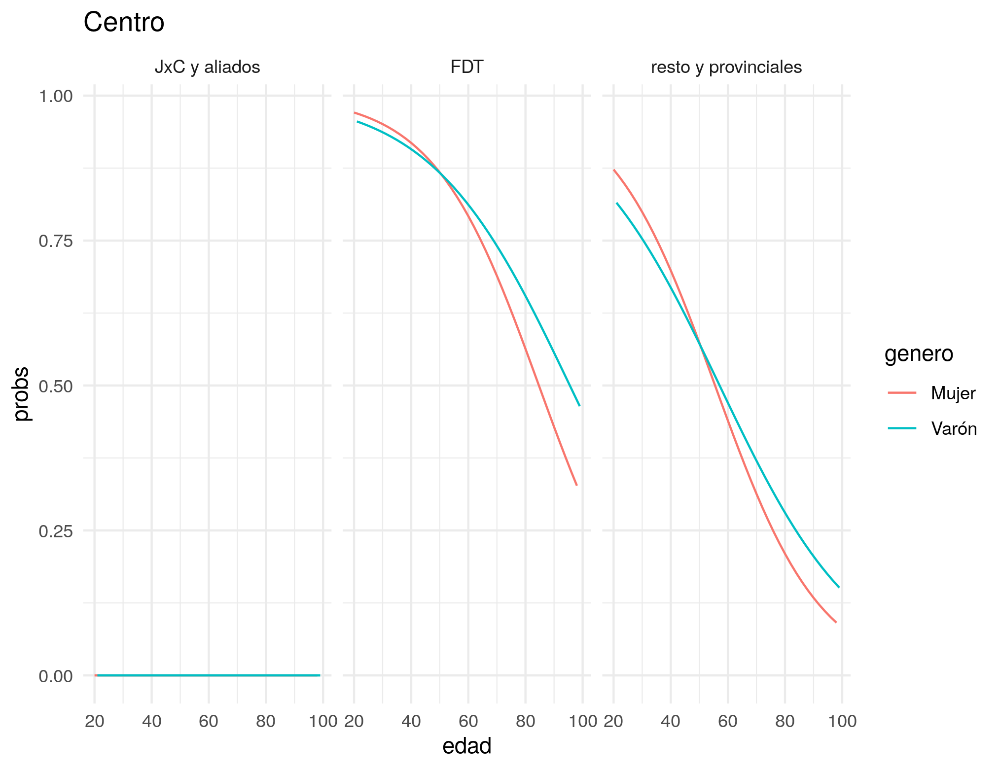
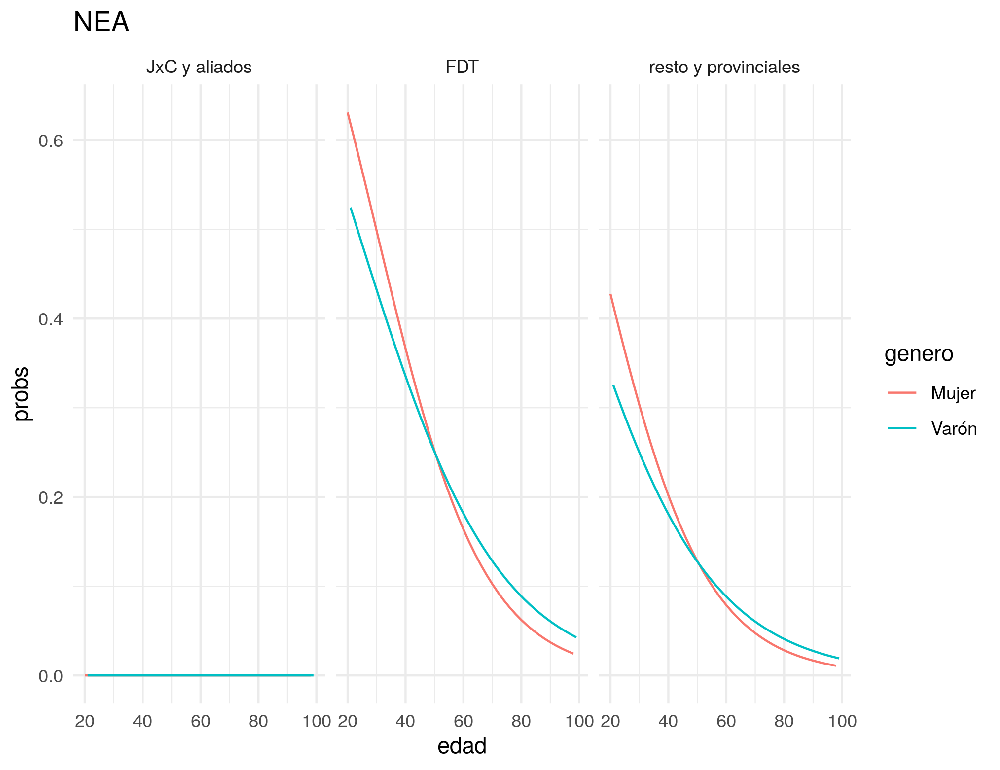
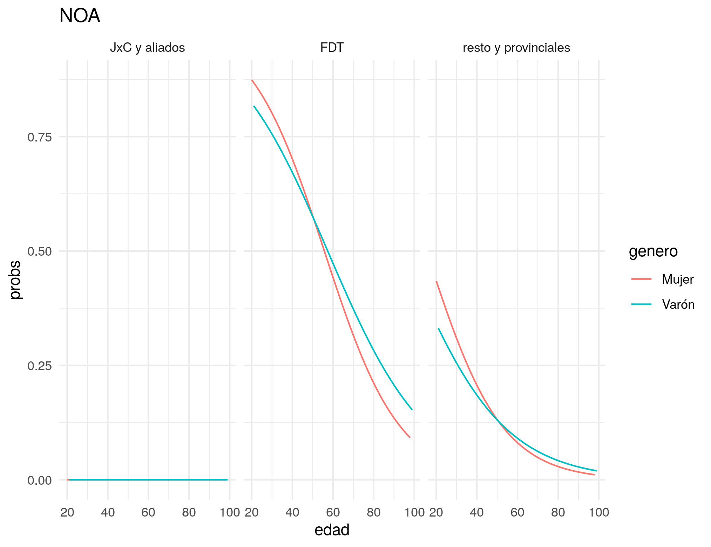
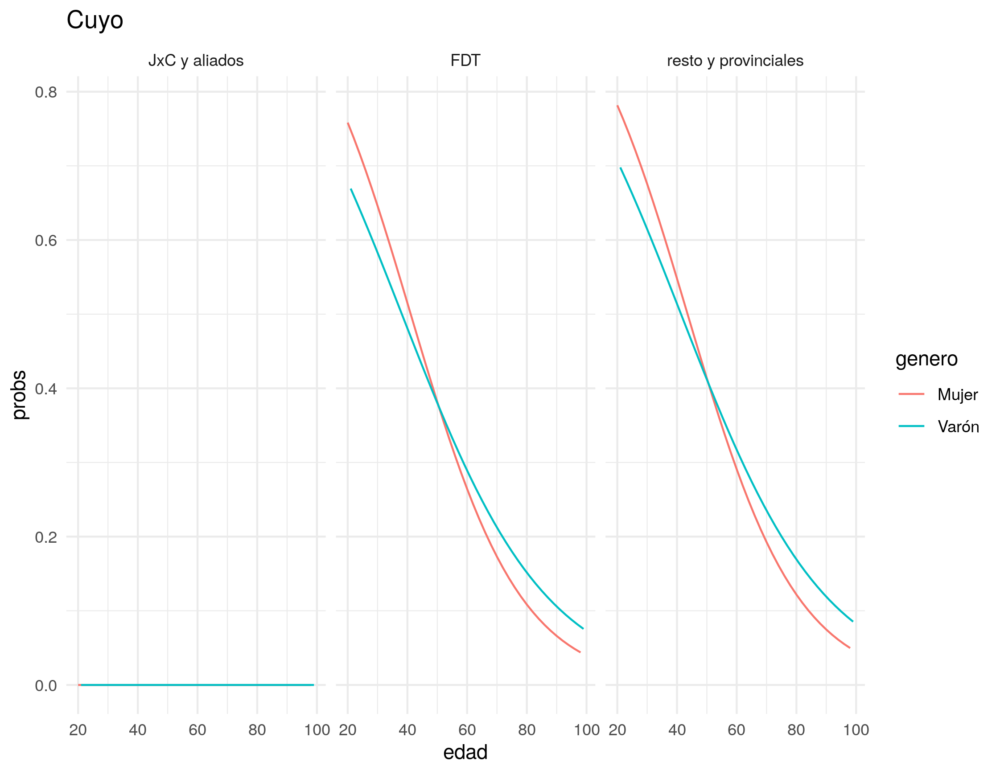
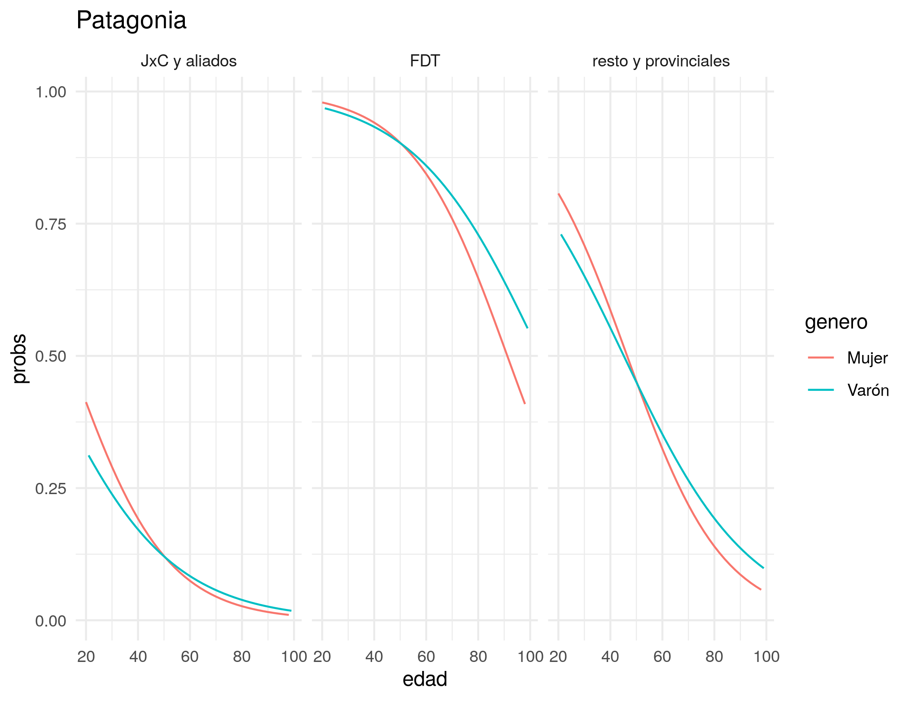

```{r setup, include=FALSE}
library(tint)
library(tidyverse)
library(janitor)
# invalidate cache when the package version changes
knitr::opts_chunk$set(tidy = FALSE, cache.extra = packageVersion('tint'))
options(htmltools.dir.version = FALSE)

df <- read_csv('../data/datos_finales.csv')
df <- tibble::rowid_to_column(df, "ID")

dip <- df %>%
        filter(votacion_final1 != 'presidente') %>%
        select(ID, genero, edad, provincia, bloque, votacion_final1) %>%
        mutate(
                votacion_final1 = factor(case_when(
                        votacion_final1 == 'negativo' ~  0 ,
                        votacion_final1 == 'abstencion' ~ 0,
                        votacion_final1 == 'afirmativo' ~ 1,
                        votacion_final1 == 'ausente' ~ 0,
                ), levels=c('0', '1'), labels=c('negativo', 'positivo')),
                genero = as.factor(genero),
                provincia = as.factor(provincia),
                bloque = as.factor(bloque)) %>%
        mutate(bloque = as.factor(case_when(
                bloque == 'frente de todos' ~ 'FDT',
                bloque == 'pro' | bloque == 'ucr' | bloque == 'coalicion civica' ~ 'JxC y aliados',
                TRUE ~ 'resto y provinciales')
        ),
        region = as.factor(case_when(
                provincia == 'tucuman' ~ 'NOA', 
                provincia == 'salta' ~ 'NOA',
                provincia == 'misiones' ~ 'NEA', 
                provincia == 'chaco' ~ 'NEA', 
                provincia == 'corrientes' ~ 'NEA', 
                provincia == 'santiago del estero' ~ 'NOA',
                provincia == 'jujuy' ~ 'NOA', 
                provincia == 'formosa' ~ 'NEA', 
                provincia == 'catamarca' ~ 'NOA', 
                provincia == 'la rioja' ~ 'NOA', 
                provincia == 'mendoza' ~ 'Cuyo', 
                provincia == 'san juan' ~ 'Cuyo',
                provincia == 'san luis' ~ 'Cuyo',
                provincia == 'cordoba' ~ 'Centro',
                provincia == 'santa fe' ~ 'Centro',
                provincia == 'entre rios' ~ 'Centro',
                provincia == 'rio negro' ~ 'Patagonia',
                provincia == 'neuquen' ~ 'Patagonia',
                provincia == 'chubut' ~ 'Patagonia',
                provincia == 'la pampa' ~ 'Patagonia',
                provincia == 'santa cruz' ~ 'Patagonia',
                provincia == 'tierra del fuego' ~ 'Patagonia',
                provincia == 'buenos aires' ~ 'Buenos Aires',
                provincia == 'ciudad autonoma de buenos aires' ~ 'CABA')
        )
        )
```

# Introducción
Se habló mucho en estos días sobre la votación del proyecto de ley de "Interrupción Voluntaria del Embarazo" (IVE). Básicamente, se contaron votos y se dijeron cosas como las que aparecen en las [figuras 1](https://www.lanacion.com.ar/politica/aborto-los-mayores-aportes-votos-favor-fueron-nid2536819) [2](https://www.pagina12.com.ar/311393-aborto-legal-como-voto-cada-diputado), y [3](https://www.pagina12.com.ar/311466-aborto-legal-como-fue-el-voto-provincia-por-provincia):

```{r ln, echo=FALSE, fig.cap="Nota de La Nación del 11/12/2020", fig.margin=TRUE, warning=FALSE, cache=TRUE, out.width='130%'}

```

Descompongamos el primer titular y tratemos de operacionalizar las variables que menciona:

- "los bonaerenses" -> habla de un efecto a nivel de "provincia" o "región"
- "oficialistas" -> hace referencia al bloque
- "jóvenes" -> bueno... éste es medio obvio

Ejemplos abundan y todos coinciden en general en señalar estas variables como determinantes. En algunos casos, se mencionó que los varones eran menos proclives a votar de forma positiva.
```{r p21, echo=FALSE, fig.cap="Nota de Página12 del 11/12/2020", fig.margin=TRUE, warning=FALSE, cache=TRUE, out.width='130%'}

```
Ahora bien, cuando uno mira un poco la "metodología" atrás de estas variables se ve que en algunos casos están flojitas de papeles. Es decir, el proceso que lleva de los datos que se construyen a las conclusiones que se presentan parece estar un tanto sesgado hacia las prenociones que se tienen respecto a la votación. El caso del titular de la "tribuna de doctrina" es bastante evidente.

Vamos a ver un ejemplo:

> Fueron 50 los legisladores de la Provincia [de Buenos Aires] que se pronunciaron a favor, un número que permitió contrarrestar los votos opositores del norte del país, que fueron 49, dado que, en la región norteña, la mayoría rechazó la ley.
>
> `r quote_footer('--- La Nación 11/12/2020')`

Se observa cómo se utilizan conteos simples y distribuciones de frecuencias para llegar a las conclusiones. El problema acá es doble.

```{r p122, echo=FALSE, fig.cap="Nota de Página12 del 11/12/2020", fig.margin=TRUE, warning=FALSE, cache=TRUE, out.width='130%'}

```
- Por un lado, no se tiene en cuenta la distribución relativa de la variable: es bastante probable que Buenos Aires sea la provincia que mayor cantidad de legisladores aporte... a cualquier votación! Simplemente porque es la que mayor cantidad de legistadores tiene.

- Por otro lado, estamos viendo de a una variable por vez... vemos primero la provincia, luego la edad, luego el bloque y así sucesivamente. El problema aquí se presenta si alguna de las variables está relacionada con otra. Por ejemplo, ¿qué pasaría si por algún motivo, las mujeres jóvenes tuvieran mayor probabilidad de votar a favor? ¿O si los legisladores del FDT de alguna provincia votaran de forma diferente al resto de sus compañeres de bloque? En términos estadísticos se llama a este hecho "interacción", es decir, el efecto conjunto de dos variables sobre un mismo output.

¿Cómo podríamos resolver ambos problemas? Una primera forma sería armar una bruta tabla que cruce todas las variable: género, edad, bloque, región y la variable dependiente (voto positivo o negativo). Para que nos demos una idea, esa tabla tendría aproximadamente unas 5.000 celdas. Así que, quizás no sea la forma más fácil de trabajar este problema.

Vamos a ir por una segunda opción. Vamos a tratar de construir un modelo simple que nos permita extraer algunas conclusiones sobre estas cinco variables y nos posibilite presentar la información de forma más compacta.

## Modelando el voto a la IVE
Sin ponernos extremadamente técnicos, digamos que lo que intentamos hacer es estimar la probabilidad que cada diputade tiene de haber votado a favor del proyecto IVE. A su vez, esa probabilidad la "modelamos"^[Que es una forma elegante de decir, "la analizamos como" o "la pensamos como"] como una función del género, la región, el bloque y la edad de cada une.

```{marginfigure}
Para ser más exactos (y hacernos les capes), modelamos la probabilidad con la sigueinte fórmula:
$$P(y=1 | X) = \frac{1}{1 + \epsilon^{-(\beta_{0} + \beta_{1}X_{1} + \beta_{2}X_{2} + \beta_{3}X_{3} + \beta_{4} X_{4}}}$$

Donde $P(y=1)$ es la probabilidad de voto afirmativo; $X_{1}$ es el género, $X_{2}$ es la edad, $X_{3}$ es el bloque, $X_{4}$ es la región.

Este modelo se llama _regresión logística_. Una explicación muy clara de esta técnica pueden encontrarla [acá](https://daviddalpiaz.github.io/r4sl/logistic-regression.html) o una un poco más técnica [acá](http://faculty.marshall.usc.edu/gareth-james/ISL/)
```

La variable bloque la construimos de la siguiente forma:

- PRO, UCR y Coalición Cívica fueron clasificados como `JxC y aliados`
- El Frente de Todos quedó tal como está: `FDT`
- La izquierda, el socialismo y otros partidos provinciales fueron clasificados como `resto y provinciales`

A su vez, agrupamos las provincias en las siguientes regiones:

- `NEA`: Chaco, Corrientes, Formosa y Misiones
- `NOA`: Catamarca, Jujuy, La Rioja, Salta, Santiago del Estero y Tucumám
- `Cuyo`: Mendoza, San Juan y San Luis
- `Centro`: Córdoba, Entre Ríos y Santa Fe
- `Patagonia`: Chubut, La Pampa, Neuquén, Río Negro, Santa Cruz y Tierra del Fuego
- `CABA`
- `Buenos Aires`


## Bueno, basta... ¡Mostrame la DATA!

```{r pvalores, echo=FALSE, fig.cap="Variables relevantes para explicar el voto de les diputades", fig.fullwidth=TRUE, warning=FALSE, cache=TRUE, out.width='70%'}

```

Todo muy lindo pero vamos a ver entonces qué resultados arrojó el modelo. Un primer análisis que se puede intentar hacer es mirar qué variables son "significativas". Es decir, cuáles son las $X$'s que tienen una "influencia" que podemos asumir diferente a cero. Eso lo podemos ver analizando los llamados [p-valores](https://en.wikipedia.org/wiki/P-value)^[
Los p-valores (aplicados a este problema puntual) de cada variable vendrían a ser algo así como la probabilidad de haber obtenido los datos observados si la influencia de cada variable fuera cero. De esta forma, a menor p-valor, mayor significatividad de la variable en cuestion. Convencionalmente, p-valores menores a 0.05 se consideran significativos].

Veamos, entonces, la figura 4 . Ahí marcamos un primer nivel de significatividad en color amarillo (p-value < 0.05) y otro en azul (p-value < 0.10). Si vemos las variables que están por debajo de la línea amarilla, veremos que la región (particularmente, NEA, CUYO y NOA), el bloque (puntualmente el de JxC) y la edad son las variables más relevantes.

A su vez, y contra algunas afirmaciones un tanto apresuradas que estuvieron circulando, no parece tan cierto que el género sea una variable relevante en esta votación. Y aquí vemos una de las ventajas de este tipo de análisis (que desde ya, no es el único posible, ni el necesariamente mejor, ni tampoco uno definitivo). 

Si vemos el conteo crudo de votos, efectivamente los hombres votaron en menor medida que las mujeres a favor de la IVE: 48% contra 55%. Pero pareciera que existen otras variables afectando.
```{r tabla1, echo=FALSE, caption="Distribucion de votos por género", fig.margin=TRUE, warning=FALSE, cache=TRUE}
knitr::kable(dip %>%
        janitor::tabyl(votacion_final1, genero) %>%
                adorn_percentages("col") %>%
                adorn_pct_formatting(digits = 2) %>%
                adorn_ns()
        , caption="Distribucion de votos por género")

```


Efectivamente, al introducir las otras tres variables, la significatividad del género desaparece. Es por ello que este tipo de análisis multivariados son relevantes.
 
Ahora bien, esto solo nos habla de la importancia de cada variable. Pero no nos dice nada acerca de la FORMA en que cada variable independiente afecta a la dependiente. Para eso, vamos a tener que hacer algunas cuentas. Como puede verse en la nota 1 nuestro modelo da una ecuación que sirve para vincular las variables independientes con la dependente. Dado que nuestro modelo tiene muchos coeficientes, vamos a pensar en un ejemplo más simple. 

\pagebreak
Supongamos, entonces, que la probabilidad de voto positivo dependiera solamente de la edad. En este ejemplo hipotético, corremos nuestra regresión y obtenemos el siguiente modelo:

$$P(y=1 | X) = \frac{1}{1 + \epsilon^{-(1 - 0.004 \times edad)}}$$

De esta forma, si imagináramos en une diputade que tiene 34 años podríamos calcular la probabilidad de voto afirmativo reemplazado $edad=34$:

$$P(y=1 | X) = \frac{1}{1 + \epsilon^{-(1 - 0.004 \times 34)}}=0.703$$

Es decir que este diputade tendría una probabilidad de 70% de votar a favor de la IVE. Bancamos mucho a este diputade virtual.

Ahora bien, con esta idea podemos construir "perfiles hipotéticos" de diputades que nos ayuden a entender mejor cómo interactúan las diferentes variables. A esta operación se la suele llamar [post-estimacion](https://stats.idre.ucla.edu/stata/webbooks/logistic/chapter3/lesson-3-logistic-regression-diagnostics/).

Veamos: las figuras 5 a 11 realizan esta operacion para las diferentes regiones. Es decir, para cada región construyen "diputades frankestein" de diferentes edades, género y bloque y sus respectivas probabilidades de votar a favor de la IVE. A título de ejemplo, veamos la figura de de Buenos Aires

```{r pba, echo=FALSE, fig.cap="Interacciones entre variables para explicar el voto de les diputades de Buenos Aires", fig.fullwidth=TRUE, warning=FALSE, cache=TRUE, out.width='80%'}

```

Cuando consideramos la pertenencia partidaria interactuando con la edad, el sexo y la región, podemos observar varias cuestiones.

1. En términos generales, no pareciera registrarse diferencias significativas entre varones y mujeres.

2. A su vez, a medida que aumenta la edad disminuye la probabilidad de votar afirmativamente.

3. El FDT tiene mayor probabilidad de voto afirmativo a la IVE.

4. Sin embargo, en Centro, Cuyo, NEA y NOA, el efecto más fuerte es el del bloque de diputades de JxC y aliados: no se observan diferencias en la probabilidad de voto positivo por edad. En estas regiones, el voto de JxC es siempre negativo.

Por lo tanto, pareciera ser más relevante para determinar el voto, la región (a partir de la provincia representada) y la edad que la influencia de otras variables.

# Para ir terminando...

Con este ejercicio quisimos mostrar con un caso concreto cómo partiendo de hipótesis intuitivas (y no tan intuitivas) se puede construir un problema de investigación (muy acotado) que permite resolverse a partir de técnicas estadísticas. Los resultados de este ejercicio posibilitan analizar cómo interactúan diferentes variables y ser más preciso a la hora de interpretar las dimensiones que influyen al momento de votar un proyecto “polémico” como es el de la IVE.

Obviamente, la idea no es sacar conclusiones definitivas sino aportar una de las formas posibles de realizar una lectura de la votación en Diputados. Estamos seguros que éste es sólo un primer ejercicio y que quedan pendientes algunos aspectos: por un lado, la posibilidad de incluir otras variables relevantes que también pueden influir en la decisión de la votación como por ejemplo la creencia o la práctica religiosa y por el otro, la aplicación de otras técnicas y modelos que complementarían y enriquecerían los resultados alcanzados aquí.

```{r caba, echo=FALSE, fig.cap="Interacciones entre variables para explicar el voto de les diputades de CABA", fig.fullwidth=TRUE, warning=FALSE, cache=TRUE, out.width='80%'}

```
```{r centro, echo=FALSE, fig.cap="Interacciones entre variables para explicar el voto de les diputades de la región Centro", fig.fullwidth=TRUE, warning=FALSE, cache=TRUE, out.width='80%'}

```
```{r nea, echo=FALSE, fig.cap="Interacciones entre variables para explicar el voto de les diputades de la región NEA", fig.fullwidth=TRUE, warning=FALSE, cache=TRUE, out.width='80%'}

```
```{r noa, echo=FALSE, fig.cap="Interacciones entre variables para explicar el voto de les diputades de la región NOA", fig.fullwidth=TRUE, warning=FALSE, cache=TRUE, out.width='80%'}

```
```{r cuyo, echo=FALSE, fig.cap="Interacciones entre variables para explicar el voto de les diputades de la región Patagonia", fig.fullwidth=TRUE, warning=FALSE, cache=TRUE, out.width='80%'}

```
\pagebreak
```{r patagonia, echo=FALSE, fig.cap="Interacciones entre variables para explicar el voto de les diputades de la región Patagonia", fig.fullwidth=TRUE, warning=FALSE, cache=TRUE, out.width='80%'}

```